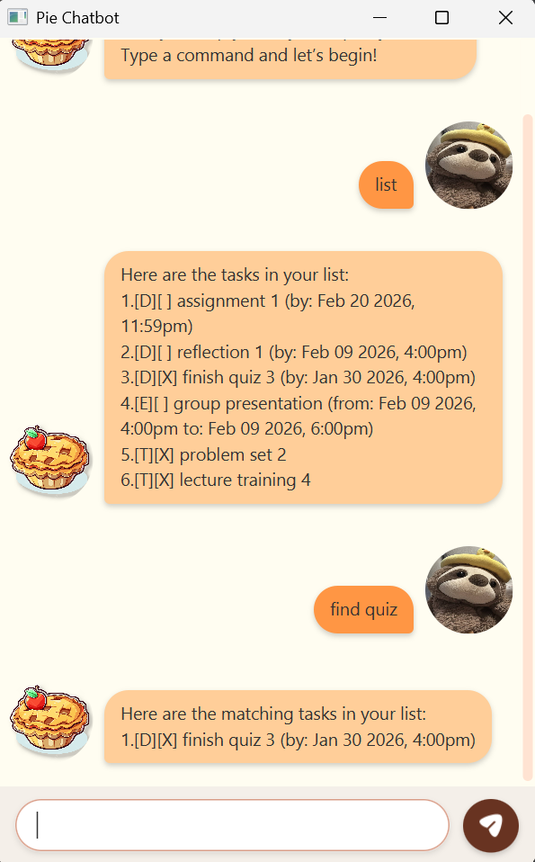

# Pie User Guide

## Pie Chatbot

**Pie Chatbot** is a simple chabot that helps users add, track, and organize tasks such as todos,
deadlines, and events. It is designed primarily for use through a **Command Line Interface** (CLI),
while still offering the visual advantages of a **Graphical User Interface** (GUI).



## Quick Start

1. Ensure you have Java ```17``` or above installed on your computer.

2. Download the latest ```pie.jar``` from [here](https://github.com/SeePui/ip/releases).

3. Save the file to a folder that you want to use as the main folder for Pie Chatbot.

4. Open a command terminal, ```cd``` into the folder to which you downloaded the jar file, and run the
   ```java -jar pie.jar``` command to run the application.
   A GUI similar to the one below should appear in a few seconds. **Please note that your version will be a fresh copy
   and only the welcome message will be displayed.**

   

5. Refer to the Features below for details of each command.

## Features

### Listing all the tasks: ```list```

Shows a list of all tasks in the list.

Format: ```list```

### Adding Todos: ```todo```

Create a 'todo' task with the description given.

Format: ```todo [DESCRIPTION]```

Examples:

- ```todo buy book``` will create a todo task with the description of ```buy book```

### Adding Deadlines: ```deadline```

Create a 'deadline' task with the description and date given.

Format: ```deadline [DESCRIPTION]```

Examples:

- ```deadline finish quiz /by 2026-02-09 1600``` will create a deadline task with the description of ```finish quiz```
  with the date by ```2026-02-09 1600```

### Adding Events: ```event```

Create an 'event' task with the description and date given.

Format: ```event [DESCRIPTION] /from [yyyy-MM-dd HHmm] /to [yyyy-MM-dd HHmm]```

Examples:

- ```event project meeting /from 2026-02-04 2000 /to 2026-02-04 2100``` will create an event task with the description
  of ```project meeting``` with the date from ```2026-02-04 2000``` to ```2026-02-04 2100```

### Marking a task: ```mark```

Marks a specific task from the list as done.

Format: ```mark [INDEX]```

- Marks the task at the specified INDEX.
- The index refers to the index number shown in the displayed task list.
- The index **must be a positive integer** 1, 2, 3, ...

Examples:

- ```list``` followed by ```mark 2``` marks the 2nd task in the list as done.

### Unmarking a task: ```unmark```

Unmarks a specific task from the list as done.

Format: ```unmark [INDEX]```

- Unmarks the task at the specified INDEX.
- The index refers to the index number shown in the displayed task list.
- The index **must be a positive integer** 1, 2, 3, ...

Examples:

- ```list``` followed by ```ummark 2``` unmarks the 2nd task in the list as done.

### Deleting a task: ```delete```

Deletes a specific task from the list.

Format: ```delete [INDEX]```

- Deletes the task at the specified INDEX.
- The index refers to the index number shown in the displayed task list.
- The index **must be a positive integer** 1, 2, 3, ...

Examples:

- ```list``` followed by ```delete 2``` deletes the 2nd task in the list.

### Finding some tasks: ```find```

Finds all tasks in the list containing the given keywords.

Format: ```find [KEYWORD]```

- The search is not case-sensitive. e.g. ```book``` will match ```Book```
- The order of the keywords does matter. e.g. ```project meeting``` will not match ```meeting project```
- Only the ```description``` is searched.

Examples:

- ```find quiz``` will return tasks containing the ```quiz``` keyword.

### Finding some tasks occurring on a specified date: ```on```

Finds all tasks in the list occurring on a specified date.

Format: ```on [yyyy-MM-dd]```

- For deadline the ```by``` is searched, for event the ```from``` is searched.

Examples:

- ```on 2026-02-09``` will return all the tasks occurring on ```2026-02-09```,

### Sorting tasks: ```sort```

Sorts all the tasks in the list by a specified field and order.

Format: ```sort [FIELD] [ORDER]```

- ```field``` can be ```description```, ```deadline```, or ```status```
- ```order``` can be ```asc``` (ascending) or ```desc``` (descending)

Examples:

- ```sort description asc``` will sort all tasks alphabetically by description in ascending order.
- ```sort deadline desc``` will sort all tasks by deadline in descending order (latest first).
- ```sort status asc``` will sort tasks by completion status (incomplete tasks first).

### Exiting the program: ```bye```

Exits the program.

Format: ```bye```

### Take note

Pie Chatbot data are saved in the hard disk automatically after any command that changes the data. That local file will
be located in data/pie.txt. There is no need to save manually.